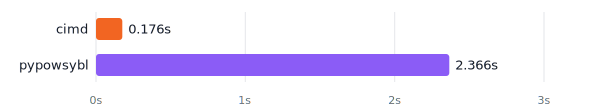

# cimd
cimd is a high-performance tool for working with CGMES (Common Grid Model Exchange Standard) data. See https://cimd.eu for more information.

## Performance



*Converting a real-world 4.8 MB zipped EQ file to JIIDM.*

*Measured on Apple M4 Pro · both tools processing the same EQ + EQBD input · median of 6 warm runs.*

## Contributing
`cimd` is alpha software. Using `cimd` today means participating in its development. 

`cimd` is not yet complete. The main functionality is present but it is only tested against the Dutch transmission grid model. We are fully aware that there will be edge cases of other TSO members that are not considered yet. I am working hard to make cimd ENTSOE-complete.

So, using cimd today does imply participating in the development process to some degree, which usually means inquiring about the development status of a feature you need, or reporting a bug by opening a discussion on CodeBerg or Github. You are most welcome to get in touch so we can improve cimd for your usecase.

<!-- FEATURES_START -->
## Features
```
$ cimd eq --help

Usage: cimd eq <subcommand> <file> [options]

Operate on a CGMES EQ (Equipment) profile.

Subcommands:
  convert    Convert EQ profile to JIIDM JSON
  browse     Interactively browse equipment objects
  get        Fetch a single object by mRID (JSON output)
  types      List all CIM types present in the file
  diff       Semantic diff between two EQ profiles

Use 'cimd eq <subcommand> --help' for more information.
```

### Convert
```
$ cimd eq convert --help

Usage: cimd eq convert <file> [options]

Convert a CGMES EQ profile to JIIDM JSON format.
Output is written to stdout unless --output is given.

Arguments:
  <file>            EQ profile (XML or ZIP)

Options:
  --eqbd <file>     EQBD boundary profile (XML or ZIP)
  --output <file>   Write output to file instead of stdout

Examples:
  cimd eq convert data/eq.zip
  cimd eq convert data/eq.zip --eqbd eqbd.zip
  cimd eq convert data/eq.zip --output network.json
```

### Browse
```
$ cimd eq browse --help

Usage: cimd eq browse <file> <mrid> [options]

Interactively browse equipment objects by following rdf:resource references.

Arguments:
  <file>    EQ profile (XML or ZIP)
  <mrid>    mRID of the object to start browsing from

Options:
  --eqbd <file>     EQBD boundary profile (XML or ZIP)

Examples:
  cimd eq browse data/eq.zip _be60a3cf-fed6-d11c-c15f-42ac6cc4e221
```

### Get
```
$ cimd eq get --help

Usage: cimd eq get <file> [<mrid>] [options]

Fetch a CIM object by mRID, or list all objects of a given type.
At least one of <mrid> or --type must be provided.
Exits 0 on success, 1 if the mRID is not found.

Arguments:
  <file>    EQ profile (XML or ZIP)
  <mrid>    mRID of the object to fetch (optional if --type is given)

Options:
  --eqbd <file>          EQBD boundary profile (XML or ZIP)
  --type <type>          Filter by CIM type (e.g. PowerTransformer)
                         Without <mrid>: list all objects of this type
                         With <mrid>: verify the object is of this type
  --fields <f1,f2,...>   Properties to include in list output (list mode only)
                         Default: IdentifiedObject.name
  --count                Print only the count of matching objects (list mode only)
  --json                 Output as JSON

Examples:
  cimd eq get data/eq.zip _be60a3cf-fed6-d11c-c15f-42ac6cc4e221
  cimd eq get data/eq.zip _be60a3cf-fed6-d11c-c15f-42ac6cc4e221 --json
  cimd eq get data/eq.zip _be60a3cf-fed6-d11c-c15f-42ac6cc4e221 --type PowerTransformer
  cimd eq get data/eq.zip --type PowerTransformer --json
  cimd eq get data/eq.zip --type PowerTransformer --count
  cimd eq get data/eq.zip --type VoltageLevel --fields IdentifiedObject.name,VoltageLevel.nominalVoltage
```

### Types
```
$ cimd eq types --help

Usage: cimd eq types <file> [options]

List all CIM types present in the EQ profile with object counts.

Arguments:
  <file>            EQ profile (XML or ZIP)

Options:
  --eqbd <file>     EQBD boundary profile (XML or ZIP)
  --json            Output as JSON array of {type, count} objects

Examples:
  cimd eq types data/eq.zip
  cimd eq types data/eq.zip --json
```

### Diff
```
$ cimd eq diff --help

Usage: cimd eq diff <file1> <file2> [options]

Compare two CGMES EQ profiles semantically. Objects are matched by mRID
across both files; properties are compared field-by-field. XML attribute
order and whitespace differences are ignored.

Exit codes:
  0  files are identical (no differences found)
  1  differences found
  2  usage error

Arguments:
  <file1>    First EQ profile (XML or ZIP)
  <file2>    Second EQ profile (XML or ZIP)

Options:
  --eqbd <file>   EQBD boundary profile (applied to both models)
  --mrid <id>     Diff a single object by mRID
  --type <name>   Restrict diff to a specific CIM type
                  With --mrid: verify the object is of this type
  --summary       Print only per-type counts (added/removed/changed)
  --json          Output as NDJSON (one object per change)

Examples:
  cimd eq diff eq_v1.zip eq_v2.zip
  cimd eq diff eq_v1.zip eq_v2.zip --mrid _abc123
  cimd eq diff eq_v1.zip eq_v2.zip --mrid _abc123 --type PowerTransformer
  cimd eq diff eq_v1.zip eq_v2.zip --type PowerTransformer
  cimd eq diff eq_v1.zip eq_v2.zip --json | jq .
  cimd eq diff eq_v1.zip eq_v2.zip --summary
```
<!-- FEATURES_END -->
