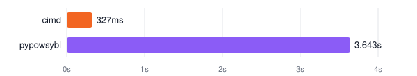

# cimd
cimd is a **C**ommand line **I**nterface for grid **M**odel **D**ata. It is a high-performance tool for working with CGMES (Common Grid Model Exchange Standard) data. See https://cimd.eu for more information.

## Performance
### Comparison on real data


*End-to-end CGMES → in-memory pypowsybl `Network` on a real-world Dutch transmission model (EQ + EQBD, ~5MB zipped). The `cimd` bar measures `cimd convert` (ReleaseFast) writing JIIDM to disk plus `pypowsybl.network.load` reading it back; the `pypowsybl` bar measures `pypowsybl.network.load_from_binary_buffers` on the same CGMES inputs.*

*Median of 10 runs after a discarded warm-up. Measured on Apple M4 Pro. Reproduce with `scripts/benchmark/main.py`.*

<!-- FEATURES_START -->
## Features
```
$ cimd --help

Usage: cimd <command> [options]

A high-performance CGMES file parser and analysis tool.

Input limits:
  XML data: max supported size is 4294967295 bytes (~4096 MiB) after unzip
    and EQ+EQBD merge.
  SHACL rule files: max supported size is 67108864 bytes (~64 MiB) after unzip.
  Non-interactive commands accept '-' as the primary data path to read
  uncompressed XML from stdin.

Commands:
  convert    Convert an EQ profile to JIIDM JSON
  browse     Interactively browse CIM objects (EQ/EQBD/TP/SSH merged view)
  get        Fetch a single object or list by type from any CIM file
  refs       List objects that reference a CIM object
  types      List CIM types present in a CIM file
  diff       Semantic diff between two EQ profiles
  topology   Generate TopologicalNodes from EQ (+SSH)
  validate   Validate a CGMES file against a SHACL rule set
  qocdc      Run Quality of CGMES Datasets and Calculations checks
  version    Print version information

Use 'cimd <command> --help' for more information about a command.
```

### Types
```
$ cimd types --help

Usage: cimd types <file> [options]

List all CIM types present in a CGMES file with object counts.
Works on any CGMES file (EQ, EQBD, TP, SSH, ...).

Arguments:
  <file>                  CGMES file (XML or ZIP)

Options:
  -j, --json              Output a JSON array of {{type, count}}

Examples:
  cimd types data/eq.zip
  cimd types data/tp.zip -j
```

### Get
```
$ cimd get --help

Usage: cimd get <file> [<mrid>] [options]

Fetch a CIM object by mRID (or a prefix of one), or list all objects of a
given type. Works on any CGMES file (EQ, EQBD, TP, SSH, ...).
At least one of <mrid> or --type must be provided.
Exits 0 on success, 1 if no object is found.

Prefix lookup:
  <mrid> may be any prefix of a full mRID. For the common rdf:ID form
  a leading underscore is optional: "_be60" and "be60" are equivalent.
  For FullModel-style ids carried in rdf:about (e.g. "urn:uuid:484c..."),
  pass the prefix literally — "urn", "urn:uuid:484c", etc. all work. When
  a prefix matches multiple objects, cimd prints the candidates and exits
  without selecting one. Large match lists show a per-type
  breakdown instead. With --json, an envelope
  `{"prefix","total","matches","types"}` is emitted regardless of match
  count. Pass --type to narrow ambiguous prefixes to a single type.

JSON errors:
  With --json, the not-found / wrong-type paths emit a structured error
  on stdout and exit 1 instead of printing to stderr:
    {"error":"not_found", "prefix":...}
    {"error":"type_mismatch", "prefix":..., "id":..., ...}
    {"error":"none_of_type", "prefix":..., "total":..., ...}

Arguments:
  <file>    CGMES file (XML or ZIP)
  <mrid>    Full mRID or a unique prefix (optional if --type is given)

Options:
  -t, --type <type>          Filter by CIM type (e.g. ConductingEquipment)
                             Includes CIM subtypes
                             Without <mrid>: list all objects of this type
                             With <mrid>: verify its type or narrow an
                             ambiguous prefix
  -f, --fields <f1,f2,...>   Include properties in list output
                             Text default: IdentifiedObject.name
                             JSON default: full object
  -c, --count                Print only the list-mode match count
  -b, --eqbd <file>          EQBD boundary profile (XML or ZIP)
      --tp <file>            TP profile (single-object mode only)
      --ssh <file>           SSH profile (single-object mode only;
                             single-object mode only)
  -j, --json                 Output as JSON. In list mode, each element is
                             {"id","type","properties","references"}
                             unless --fields narrows the projection.

Examples:
  cimd get data/eq.zip _be60a3cf-fed6-d11c-c15f-42ac6cc4e221
  cimd get data/eq.zip be60a3cf
  cimd get data/eq.zip _be60a3cf-fed6-d11c-c15f-42ac6cc4e221 -j
  cimd get data/eq.zip be60 -t PowerTransformer
  cimd get data/eq.zip _TN1 --tp tp.zip -j
  cimd get data/eq.zip _switch --ssh ssh.zip -j
  cimd get data/eq.zip -t PowerTransformer -j
  cimd get data/eq.zip -t PowerTransformer -c
  cimd get data/eq.zip -t VoltageLevel -f IdentifiedObject.name
  cimd get data/tp.zip -t TopologicalNode -c
```

### Refs
```
$ cimd refs --help

Usage: cimd refs <file> <mrid> [options]

List reverse references to a CIM object: every object whose rdf:resource
points at <mrid>, searched across the primary file plus any EQBD/TP/SSH
inputs. The <mrid> argument may be a unique prefix; the leading
underscore is optional.

--type narrows the *target* (use it to disambiguate <mrid>). --from
filters the *referrer set* (which kinds of objects point at the target).
Both filters include subtypes from the CIM inheritance graph.

Exits 0 on success (including zero referrers), 1 if <mrid> is not found.

JSON errors:
  With --json, the not-found path emits a structured error on stdout and
  exits 1; an ambiguous prefix emits the standard ambiguity envelope on
  stdout and exits 0:
    {"error":"not_found", "prefix":...}
    {"prefix":..., "total":..., "matches":[...], "types":[...]}

Arguments:
  <file>    CGMES file (XML or ZIP); typically EQ
  <mrid>    Full mRID or a unique prefix

Options:
  -t, --type <type>     Narrow the target type
      --from <type>     Only show referrers of this CIM type
  -b, --eqbd <file>     EQBD boundary profile (XML or ZIP)
      --tp <file>       TP topology profile (XML or ZIP)
      --ssh <file>      SSH steady-state hypothesis profile (XML or ZIP)
  -j, --json            Output {"id","type","referrers":[...]}

Examples:
  cimd refs data/eq.zip _line-mrid
  cimd refs data/eq.zip _0 -t LinearShuntCompensator
  cimd refs data/eq.zip line-prefix --from AssessedElement -j
  cimd refs data/eq.zip _TN1 --tp tp.zip
```

### Browse
```
$ cimd browse --help

Usage: cimd browse <file> <mrid> [options]

Interactively browse CIM objects by following rdf:resource references.
When --tp or --ssh is passed, patches from those profiles are shown
inline alongside the primary object, and new objects from TP (e.g.
TopologicalNodes) become navigable by mRID.

<mrid> may be a prefix of a full mRID; the leading underscore is optional.
The prefix is matched against EQ objects and, when --tp is given,
TP-added objects (e.g. TopologicalNodes). When a prefix matches more than
one object, browse opens a picker menu — flat list when few candidates,
grouped by type when many.

Arguments:
  <file>    Primary CIM file (typically EQ; XML or ZIP); '-' is not
            supported because browse reserves stdin for interaction
  <mrid>    Full mRID or a prefix of one

Options:
  -b, --eqbd <file>           EQBD boundary profile (XML or ZIP)
  -t, --tp <file>             TP topology profile (XML or ZIP)
  -s, --ssh <file>            SSH profile (XML or ZIP)

Examples:
  cimd browse data/eq.zip _be60a3cf-fed6-d11c-c15f-42ac6cc4e221
  cimd browse data/eq.zip be60a3cf
  cimd browse data/eq.zip _abc --tp tp.zip -s ssh.zip
```

### Diff
```
$ cimd diff --help

Usage: cimd diff <file1> <file2> [options]

Compare two CGMES EQ profiles semantically. Objects are matched by mRID
across both files; properties are compared field-by-field. XML attribute
order and whitespace differences are ignored.

By default an EQDIFF difference model (IEC 61970-552) is written to
stdout (or --output): dm:forwardDifferences holds the statements to add
going from <file1> to <file2>, dm:reverseDifferences the statements to
remove. Output is deterministic — the same inputs always produce a
byte-identical file. Use --patch, --json, or --summary for a
report-style view instead.

Exit codes:
  0  files are identical (no differences found)
  1  requested mRID was not found
  2  usage error
  3  differences found
  65  invalid or unsupported input data
  66  input unavailable
  70  unexpected internal failure
  71  operating-system or resource failure

Arguments:
  <file1>    First EQ profile (XML or ZIP)
  <file2>    Second EQ profile (XML or ZIP)

Options:
  -b, --eqbd <file>       EQBD boundary profile (applied to both models)
  -i, --mrid <id>         Diff a single object by mRID
  -t, --type <name>       Restrict diff to a CIM type and its subtypes
                          With --mrid: verify the object is of this type
  -o, --output <file>     Write output to file instead of stdout
  -p, --patch             Human-readable report modelled after `git diff`
  -s, --summary           Print per-type change counts
  -j, --json              Output as NDJSON (one object per change)
                          Cannot be combined with --patch or --summary

Examples:
  cimd diff eq_v1.zip eq_v2.zip -o eqdiff.xml
  cimd diff eq_v1.zip eq_v2.zip -p
  cimd diff eq_v1.zip eq_v2.zip -i _abc123 -t PowerTransformer
  cimd diff eq_v1.zip eq_v2.zip -t PowerTransformer
  cimd diff eq_v1.zip eq_v2.zip -j | jq .
  cimd diff eq_v1.zip eq_v2.zip -s
```

### Validate
```
$ cimd validate --help

Usage: cimd validate <file> --rules <ttl|zip> [options]

Validate a CGMES instance file against a SHACL rule set (e.g. the
ENTSO-E application-profile constraints). Any profile works — EQ, SSH,
TP, SV — supply the rule sets published for that profile. Rule sets
are external inputs: point --rules at any SHACL/Turtle file, or a zip
containing one. Rules the engine cannot execute (sh:sparql above all)
are counted and named in the report, never silently dropped.

Every violation reports the data file name, the line number of the
object, the rule code, and the rule's own message. Load errors in the
rules file report file and line the same way.

Exit codes:
  0  no violations (warnings and info findings do not fail the run)
  2  usage error
  4  violations found
  65  invalid or unsupported input data
  66  input unavailable
  70  unexpected internal failure
  71  operating-system or resource failure

Arguments:
  <file>                  CGMES instance file, any profile (XML or ZIP)

Options:
  -r, --rules <file>      SHACL rule set, Turtle or zipped Turtle
                          (repeatable, at most 16 per run)
  -b, --eqbd <file>       EQBD boundary profile merged into the model
                          before validation (XML or ZIP)
  -o, --output <file>     Write the report to a file instead of stdout
      --list-skipped      List every rule the engine cannot execute

Examples:
  cimd validate data/eq.zip -r rules/profile.ttl
  cimd validate data/eq.zip -b eqbd.zip -r a.ttl -r b.ttl
```

### Topology
```
$ cimd topology --help

Usage: cimd topology <file> [options]

Generate TopologicalNodes from an EQ profile and optional SSH. Each TN is
a connected component of ConnectivityNodes joined by *closed* switches —
equivalent to a CGMES TP profile's terminal→TopologicalNode mapping.
Output is JSON on stdout.

Without --ssh, all switches are treated as closed (electrical-equivalence
snapshot ignoring switch state).

Arguments:
  <file>                  EQ profile (XML or ZIP)

Options:
  -b, --eqbd <file>       EQBD boundary profile (XML or ZIP)
  -s, --ssh <file>        SSH steady-state hypothesis profile (XML or ZIP)
  -o, --output <file>     Write output to file instead of stdout

Examples:
  cimd topology data/eq.zip -s ssh.zip
  cimd topology data/eq.zip --eqbd eqbd.zip -s ssh.zip -o tn.json
```

### Convert
```
$ cimd convert --help

Usage: cimd convert <file> [options]

Convert a CGMES EQ profile to JIIDM JSON format.
Output is written to stdout unless --output is given.

Arguments:
  <file>                  EQ profile (XML or ZIP)

Options:
  -b, --eqbd <file>       EQBD boundary profile (XML or ZIP)
  -t, --tp <file>         TP topology profile (XML or ZIP)
  -s, --ssh <file>        SSH steady-state hypothesis profile (XML or ZIP)
  -o, --output <file>     Write output to file instead of stdout
      --bus-branch        Emit one JIIDM bus per TopologicalNode
                          Requires --tp. Default is node-breaker even
                          when TP is given (matches pypowsybl).

Examples:
  cimd convert data/eq.zip
  cimd convert data/eq.zip --eqbd eqbd.zip
  cimd convert data/eq.zip --eqbd eqbd.zip -s ssh.zip
  cimd convert data/eq.zip -o network.json
  cimd convert data/eq.zip --tp tp.zip --bus-branch
```
<!-- FEATURES_END -->
